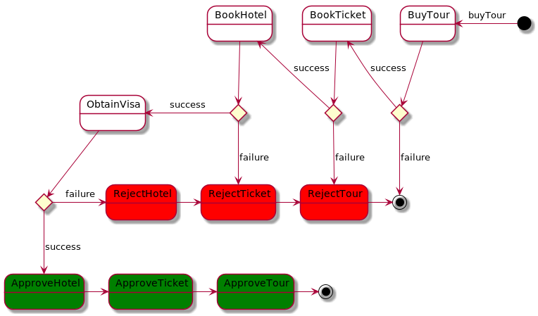
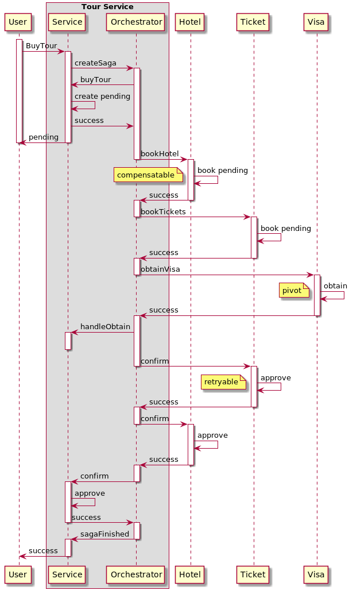
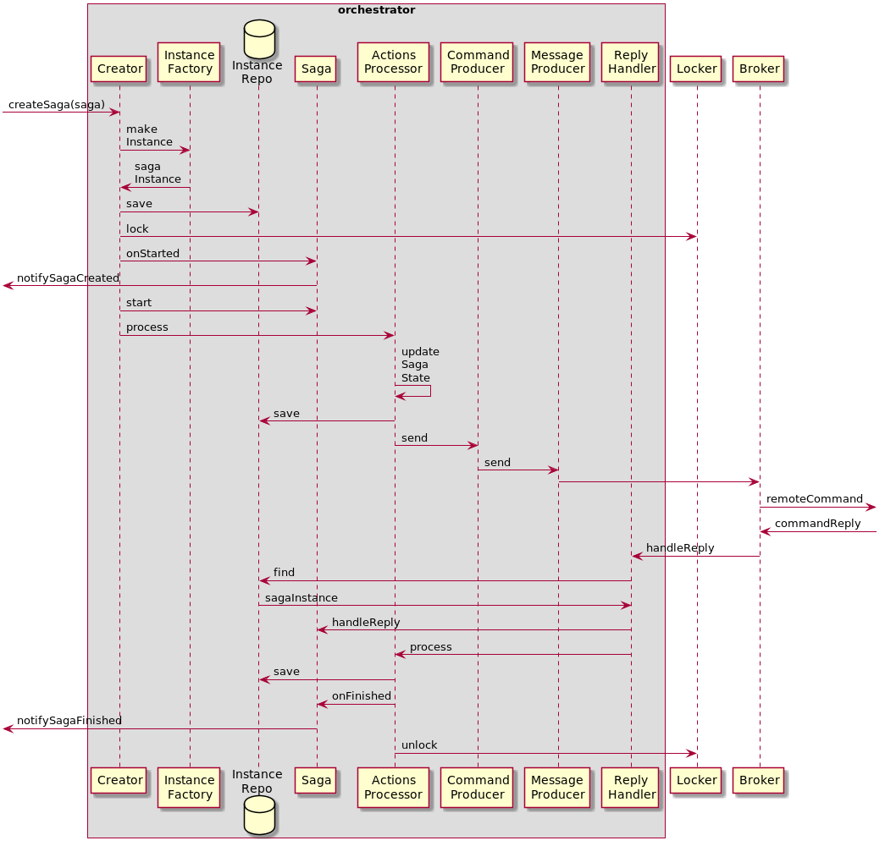

# Saga Orchestrator

[](https://codecov.io/gh/phpsagas/orchestrator)

## Table Of Contents
- [Introduction](#introduction)
- [Requirements](#requirements)
- [About package](#about-package)
- [Installation](#installation)
- [Getting started](#getting-started)
  - [Configuration](#configuration)
  - [Saga creation](#saga-creation)
- [Internal](#internal)  
- [License](#license)

## Introduction
A [saga](https://en.wikipedia.org/wiki/Long-running_transaction) is a data consistency maintaining mechanism used in distributed systems (such as microservices-based applications) each of which has own database, making it impossible to use ACID.  
The saga pattern represents a local transactions sequence executing through asynchronous messaging communication.   
It can be seen as an alternative to [2PC protocol](https://en.wikipedia.org/wiki/Two-phase_commit_protocol) saving important microservices architecture advantages such as the possibility of using an appropriate storage for concrete microservices nature, as well as asynchronous messaging for high availability and loose coupling. Also it increased flexibility and scalability due to avoidance of participants blocking.

There are two ways to coordinate the saga execution:
- _choreography_ - services publish and subscribes to domain events;
- _orchestration_ - execution is managed by special service that controls transactions sequence and said services that they must do. This framework implements that approach.
  
More details about sagas you can found on the [Chris Richardson site](https://chrisrichardson.net/post/microservices/2019/07/09/developing-sagas-part-1.html) or in his great book [Microservices Patterns](https://microservices.io/book).  

## Requirements  
- php: >= 7.1
- ext-json
- [phpsagas/contracts](https://github.com/phpsagas/contracts)
- psr/log: ^1.1

## About package
This component is the heart of [phpsagas framework](https://github.com/phpsagas) and is responsible for central coordination of each saga participant local transactions execution. Implementation inspired by [eventuate-tram-sagas framework](https://github.com/eventuate-tram/eventuate-tram-sagas).
You can use the orchestrator by one of the following methods:
- _as part of your project_ (just a vendor package) by including it in a service, which is a owner of distributed business-transaction;
- _as a standalone project_ having own database.  

This choice entirely dependent on your preferences. Each of the options carried advantages and drawbacks, for example usage of orchestrator as a separate service can provide possibility of another database usage, as well as deployment on high-performance hardware. However, there are some disadvantages such as an undesirable control logic centralization, as well as a single point of failure.  
Usage of orchestrator as a project package is more simple and allows to reduce messaging (using current service transactions as local commands).

## Installation
You can install the package using [Composer](https://getcomposer.org/):
```bash
composer require phpsagas/orchestrator
```

## Getting started
### Configuration
There are some interfaces you have to implement (or use existing implementations):
- `SagaFactoryInterface` - for sagas creation ([test example](tests/_support/Implementation/SagaFactory.php))
- `SagaInstanceRepositoryInterface` - sagas repository ([doctrine implementation](https://github.com/phpsagas/doctrine-bridge))
- `MessagePayloadSerializerInterface` - serialize participant commands data messages ([symfony/serializer implementation](https://github.com/phpsagas/serializer-bridge))
- `SagaSerializerInterface` - serialize sagas data ([symfony/serializer implementation](https://github.com/phpsagas/serializer-bridge))
- `MessageProducerInterface` - messages sender ([symfony/messenger implementation](https://github.com/phpsagas/messenger-bridge)))  
- `MessageIdGeneratorInterface` - generate message ids ([uuid implementation](https://github.com/phpsagas/message-id-generator)).    

Next, it is necessary to configure base orchestrator services - `Saga Creator` and `SagaReplyHandler`. You can do it using your favourite service-container ([symfony autowiring](https://symfony.com/doc/current/service_container.html#the-autowire-option), [pimple](https://github.com/silexphp/pimple), [PHP-DI](https://php-di.org/), etc) or manually (see below).  
After that, the orchestrator is ready to be used. Let's look how that works.

### Saga creation
Saga must implement `SagaInterface` by providing a type with definition consisting of steps that each distributed transaction participant has to perform.
For example, let's consider _Travel Tour Service_. The tour buying may consist of next stages distributed by some services:
- _hotel booking_ // Hotel Service
- _tickets booking_ // Tickets Service
- _visa obtaining_ // Visa Service
- _tour buying_ // Tour Service with Orchestrator

So, `BuyTourSaga` definition may seem as follows:
```php
class BuyTourSaga
{
    // ...
    public function getSagaDefinition(): SagaDefinition
    {
        $steps = $this
            ->step()
            ->localCommand($buyTourCommand) // <-- compensatable transaction
            ->withCompensation($rejectTourCommand) // <-- compensating transaction
            ->step()
            ->remoteCommand($bookTicketsCommand)
            ->withCompensation($rejectTicketsBookingCommand)
            ->step()
            ->remoteCommand($bookHotelCommand)
            ->withCompensation($rejectHotelBookingCommand)
            ->step()
            ->remoteCommand($obtainVisaCommand) // <-- pivot transaction
            ->onReply($obtainVisaReplyHandler)
            ->step()
            ->remoteCommand($confirmHotelBookingCommand) // <-- retryable transaction
            ->step()
            ->remoteCommand($confirmTicketsBookingCommand)
            ->step()
            ->localCommand($confirmTourCommand);
        ;

        return $steps->build();
    }

    public function onFinished(string $sagaId, SagaDataInterface $data): void
    {
        // notify request initiator about successful outcome
    }

    public function getSagaType(): string
    {
        return 'buy_tour_saga';
    }
    
    private function step(): StepBuilder
    {
        return new StepBuilder(new SagaDefinitionBuilder());
    }
}
```
The state machine saga representation:
  

    
The saga execution:  


Be careful when creating steps sequence of the saga definition!  
Let's say that the Visa Service is a third party project provided VisaObtain API only (with no possibility of cancellation). In that case all compensatable commands should be placed _before_ the visa obtaining command being a _pivot transaction_ defining the saga outcome ([more details about transactions categories](https://infuerno.github.io/2020/06/02/chris-richardson-microservices.html)).  
Also, the each saga lifecycle consists of creation, successful execution or failure that can include some logic implementation (e.g. using [event dispatcher](https://symfony.com/doc/current/components/event_dispatcher.html)) as the request initiator notification upon the saga completion.  
The saga can execute both local (same project with orchestrator) and remote commands. The main purpose of the command is to delegate business logic execution to application services and either update saga data (for local commands) or provide data for another microservice's logic execution (for remote commands).
    
A local command [example](tests/_support/Implementation/TravelTourSaga/Command/BuyTourCommand.php):  
```php
class BuyTourCommand implements LocalCommandInterface
{
    private $tourService;

    // inject your project service
    public function __construct(TourService $tourService)
    {
        $this->tourService = $tourService;
    }

    /**
     * @param SagaDataInterface|BuyTourSagaData $sagaData
     */
    public function execute(SagaDataInterface $sagaData): void
    {
        // buyTour logic incapsulated behind project service, not here
        $tour = $this->tourService->buyTour(
            $sagaData->getCountry(),
            $sagaData->getCity(),
            $sagaData->getDateFrom(),
            $sagaData->getDateTill()
        );
        // set created tour id to saga data for next commands usage
        $sagaData->setTourId($tour->getId());
    }

    public function getSagaDataType(): string
    {
        return BuyTourSagaData::class;
    }
}
```
A remote command [example](tests/_support/Implementation/TravelTourSaga/Command/BookTicketsCommand.php):  
```php
class BookTicketsCommand implements RemoteCommandInterface
{
    public function getCommandType(): string
    {
        return 'book_tickets_command';
    }

    public function getSagaDataClassName(): string
    {
        return BuyTourSagaData::class;
    }

    /**
     * Returns data using by another application services.
     *
     * @param SagaDataInterface|BuyTourSagaData $sagaData
     *
     * @return CommandDataInterface
     */
    public function getCommandData(SagaDataInterface $sagaData): CommandDataInterface
    {
        return new BookTicketsData(
            $sagaData->getCountry(),
            $sagaData->getCountry(),
            $sagaData->getDateFrom(),
            $sagaData->getDateTill()
        );
}
```
Local commands results processing may be performed immediately after the current application service call (see above). In order to process remote commands execution results you have to use [ReplyHandler](tests/_support/Implementation/TravelTourSaga/ReplyHandler/BookHotelReplyHandler.php):
```php
class BookHotelReplyHandler implements ReplyHandlerInterface
{
    /**
     * @param ReplyMessage                      $message
     * @param SagaDataInterface|BuyTourSagaData $sagaData
     */
    public function handle(ReplyMessage $message, SagaDataInterface $sagaData): void
    {
        if ($message->isSuccess()) {
            $payload = json_decode($message->getPayload(), true);
            $sagaData->setHotelBookingId($payload['hotelBookingId']);
        }
    }
}
``` 

## Internal  
There are three main parts or the orchestrator:
- `BuildEngine` - responsible for saga definition and represents state on execution steps;
- `InstantiationEngine` - provides methods for saga and saga instance creation;
- `ExecutionEngine` - controls saga execution, manages saga state changes:
  - `SagaCreator` - starts saga execution;
  - `SagaReplyHandler` - performs remote commands handling (used by consumers);
  - `SagaActionsProcessor` - controls saga execution, updates and saves saga state.  

Saga execution sequence:

More saga usage details available in [package tests](tests/functional/BuyTourSagaCest.php). 


## License
Saga orchestrator is released under the [MIT license](LICENSE). 
